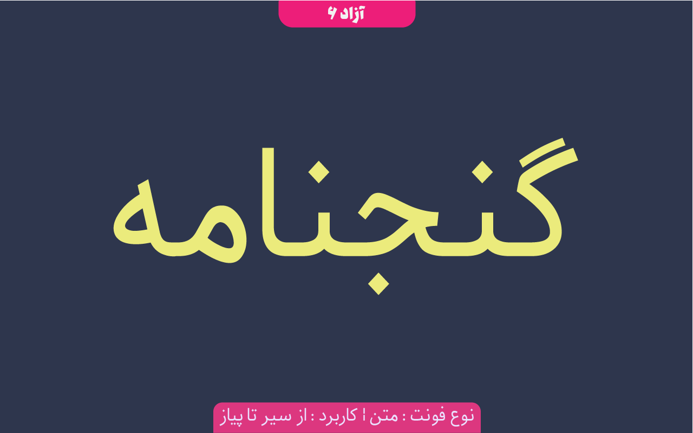
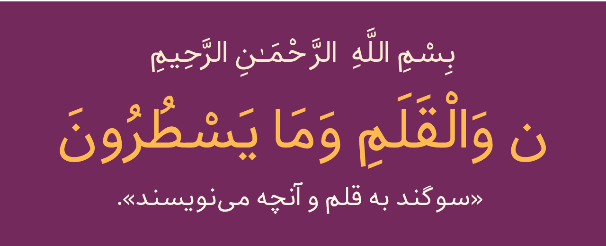
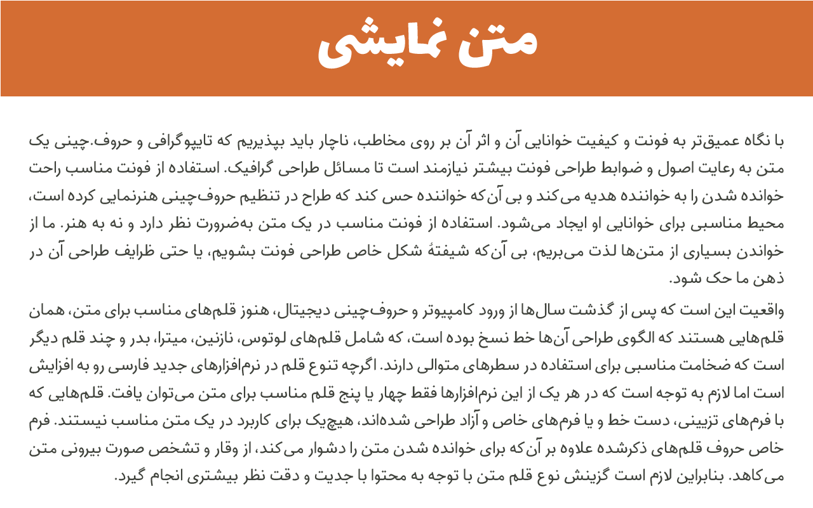
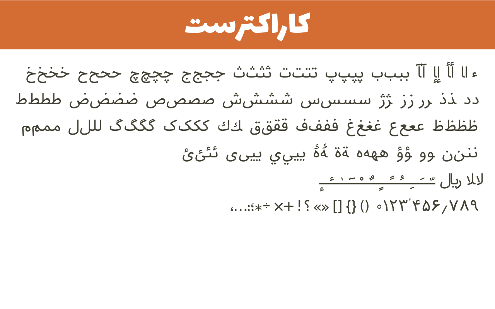

# GanjName Font Family project

GanjName is a  Persian/Arabic typeface, suitable for text.

this is a new redesign of [Iranian Font Family](https://github.com/font-store/font-Iranian) by Neviseh Pardaz Co. Ltd. (www.nevisa.com), Hooman Mehr, Hadi Navid.

Iranian Font family is discontinued develop and support

----
گنجنامه تایپ‌فیس فارسی/عربی برای متن و جهت استفاده از سیر تا پیاز می‌باشد.
گنجنامه یک خانواده از سبک‌های سنس و سریف و مونو اسپیس خواهد بود.

این فونت بازطراحی شده فونت مطرح و معروف ایرانین می‌باشد که توسط هومن مهر و هادی نوید و به سفارش سازمان فناوری اطلاعات(فکر میکنم) طراحی و پیاده‌سازی شد. اما به دلایلی همچون اعمال نشدن لایسنس صحیح به اعتقاد عده‌ای نمی‌تواند فونت آزاد باشد و …

# Status:
 version : v0.0.1   
 demo : [here](http://font-store.github.io/font-GanjNameh/online/)

# identity of project :

Classifaction : Sans & Serif & MonoSpace
Origin Designers : Hooman Mehr, Hadi Navid.
ReDesigner : [Mohammad Saleh Souzanchi](http://github.com/zoghal/)

# سرگذشت
 این خانواده فونت گنجنامه بازطراحی شده فونت ایرانین می‌باشد.

این بازطراحی حدود ۱.۵ سال پیش انجام شده بود اما به دلایلی صلاح نبود منتشر شود. تا به امروز که در فهرست ۲۰ فونت آزاد قرار گرفت با یک هویت جدید.

# درباره فونت

بعد از تحویل مستندات فونت ایرانین از مهندس هومن مهر و تصحیح لایسنس آن به OFL متاسفانه جمعی از صاحب‌نظران جامعه آزاد ایران نپذیرفتند این تغییر لایسنس را و گفتند که با تغییر لایسنس این فونت آزاد نمی‌شود!!؟.

از طرف فونتی به نام (http://fontiran.com/)[فونت ایران] که بسیار مورد توجه جامعه قرار گرفت باعث سردرگرمی و اشتباهات لفظی بسیاری می‌گشت.

لذا تصمیم گرفتم برای اینکه دیگر هیچ تردیدی در آزاد بودند این فونت بوجود نیاد و مشکلات دیگر هم رفع شود. تغییرات جدید را با یک نام جدید منتشر نمایم.

# وضعیت توسعه

گنجنامه تازه در صورت مشاهده هرگونه اشکال لطفا آن را گزارش نمایید.

# برنامه توسعه

----

# حمایت و مشارکت در توسعه فونت گنجنامه

پروسه و روند توسعه یک فونت کاریست بسیار ظریف و دقیق و بسیار زمان‌بر که میبایست با صبر و حوصله فراوان صورت گیرد. توسعه یک فونت شاید توسط یک شخص یا گروه در ابتدا آغاز گردد، اما در نهایت این فونت باید مورد تایید مصرف کنندگانش قرار گیرید و این به این معنی است که هر فونتی خواسته یا ناخواسته میبایست مخاطبین خود را مورد پوشش قرار داده  و نظرات آنها را دریافت و در تغییرات لحاظ نماید. و این تنها راهی اسیت که میشود به یک فونت فونت خوب و ایدعال دست پیدا کرد.

شما می‌توانید به دو صورت در توسعه این فونت مشارکت یا با ما سهیم شوید:

۱- در ابتدا باید یاد آوری نماییم که فراموش نکنید که این فونت یک پروژه آزاد هست، متعلق به یک شخص و یا گروه خاص نمی‌باشد ویعنی مالکیت عمومی دارد. پس خیلی راحت و بدون هیچ عذر و بهانه‌ای در مورد فونت، چهره حروف  و … نظرات خود را با ما درمیان بگذارید. یا اصلا آستین بالا زده و با ما در بهتر شدن و تکمیل این فونت همکاری نمایید. بنده هیچ ناراحت نمی‌شوم برعکس شدیدا منتظر انتقاد و پیشنهادات شما هستم.

۲- راه دیگر حمایت مالی ایست.خوب میدانید که در شرایط فعلی ایران مخارج زندگی بسیار پر هزینه است، و اینگونه پروژه‌ها نیاز به مشارکت عمومی یا اسپانسر مالی دارد.  شما می توانید با حمایت مالی که در توانتان هست در رسالت «حفظ و صیانت و گسترش خط فارسی در رسانه‌های دیجیتال» با من سهیم شوید تا با هم وبه کمک هم و  همکاری هم از این هویت ملی پاسداری نماییم.

جهت حمایت مالی هم می‌توانید از طریق این [لینک]   (https://www.payping.ir/d/a5ou) اقدام نمایید.

** سیستم جذب حمایت مالی در حال دولوپ شدند هست. متاسفانه فعلا به صورت دستی نتایج حمایت مالی را بروز می‌نمایم.

## بزرگوارانی که گنجنامه رو مورد حمایت خود  قرار دادند:

total(rials) : ۰ تومان

total(dollar) : 0$

## Preview

